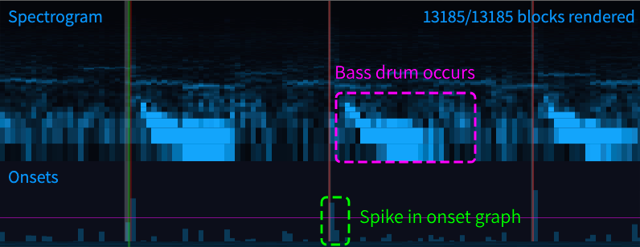
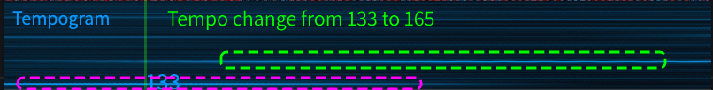

# Auto BPM Detection

This guide introduces how the *Detect Audio Sync* window works, which is
accessible through *Audio > Detect Audio Sync*.

[[toc]]

## Introduction

This window allows you to automatically detect the tempo of a song,
even if the tempo changes. It also allows you to work with obscure rhythms
by automatically highlighting them.

## Basic Guide

To start detecting tempo, click the **Start Analyzing** button at the bottom of the window.
This will bring you to the **Tempo Results** tab.

Once the song has finished analyzing, you can view the predicted song offsets based on the first BPM
in the table on the left. The tempo predictions for the current point in the song will appear on the right.

::: tip
Be aware that these predicted results may not be 100% accurate -- make sure to check the results yourself by
using **Assist Tick** and the **Metronome**. Note that algorithm works well with more percussive music.
:::

## Detection Process

The auto sync feature works by using the Fourier Transform twice. (see [this](https://resources.mpi-inf.mpg.de/departments/d4/teaching/ss2010/mp_mm/2010_MuellerGrosche_Lecture_MusicProcessing_BeatTracking_handout.pdf)). The three sections at the top of the window
(Spectrogram, Onsets, Tempogram) show detailed information about how the detection works.

In all three graphs, the green line represents the current time. The white lines represent beats,
with thicker lines being the start of a measure. Red lines represent onsets.

You can also adjust the zoom of the graphs by changing the scroll speed of the chart.

### Spectrogram
First, the audio is transformed into a spectrogram using [FFT](https://en.wikipedia.org/wiki/Fast_Fourier_transform).

A spectrogram is a three dimensional plot of the audio's frequencies.
- The vertical axis represents frequency, with lower pitched sounds at the bottom and higher ones at the top.
- The horizontal axis represents time.
- The third axis (represented as brightness) represents the amplitude, or how loud a frequency sounds.

### Onsets

Next, the algorithm will plot the changes in the spectrogram over time. This is shown in the **Onsets**
graph. When something notable happens (for example a drum beat), the spectrogram will suddenly change,
and a spike will appear in the **Onsets** graph.

Onset spikes that are above the onset threshold (represented by the pink horizontal line) will be marked with
a red vertical line. This threshold can be adjusted in the **Onset Results** tab.

Typically, you want your red lines to be aligned with your notes and beats.

### Tempogram

Finally, the algorithm will transform the onset graph into a tempogram using FFT again.

A tempogram is similar to a spectrogram, except tempo is represented on the vertical axis.
At any point in the song, predicted tempos will appear as numbers on the tempogram.

You can also view these numbers in the **Tempo Results** tab.

::: warning
The tempogram is restricted to 120-240 BPM. If the song's BPM is outside of this range, it
may have been halved or doubled to fit within it.
:::

## Analysis Options

There are 4 adjustable options that can be changed before starting analysis. The default settings
usually work well, but these can be tweaked for specific situations.

### Onsets

**FFT Step**

The FFT step represents the amount of audio to analyze around a block.
A higher value results in a more frequency-accurate, but a less time-accurate spectrogram.
Additionally, a higher value will take longer to analyze.

**Window Step**

The window step changes the number of blocks per second of audio.
A lower value results in more time-accurate spectrograms,
but may take more time and mess up tempo analysis. This value must be less than **FFT Step**.

### Tempogram

**FFT Step**

The FFT step represents the amount of the onset graph to analyze around a block.
A higher value results in more accurate tempos, but less accurate timings.
Additionally, a higher value will take longer to analyze.

**Window Step**

The window step changes the number of blocks per second of audio.
A lower value results in more time-accurate tempograms,
but may take more time. This value must be less than **FFT Step**.

## Auto-Placing Notes

For songs with tricky rhythms, you can automatically place detected onsets as notes.
Red lines that appear in the onset graph will be converted to notes and placed in the first column.

You can find these options in the **Onset Results** tab

You can adjust the threshold for a block in the onset graph to be given a red line using the
**Onset Threshold** slider. This will move the pink horizontal line in the onsets graph.

You can then click on **Place onsets as notes** or **Place onsets as notes in selection** to place
all red lines as notes.