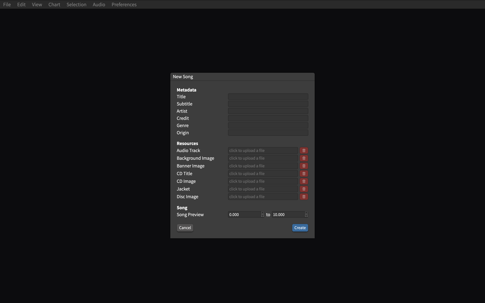
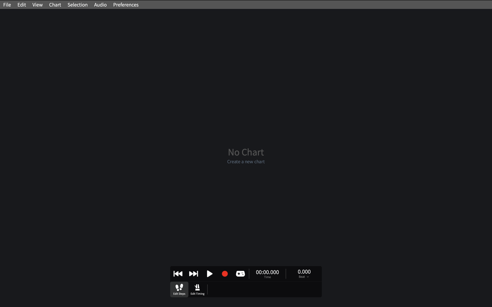
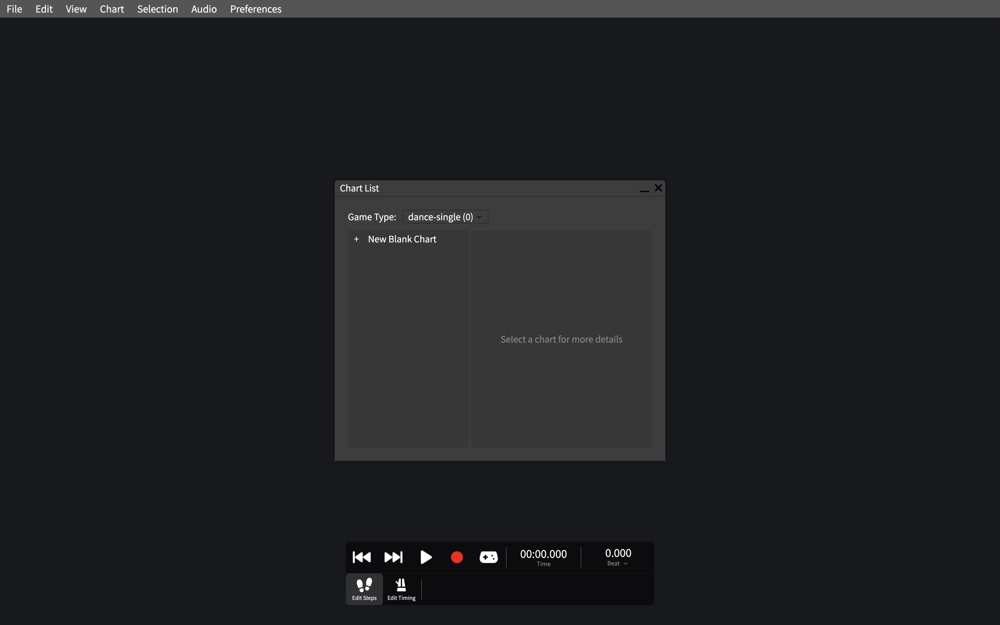
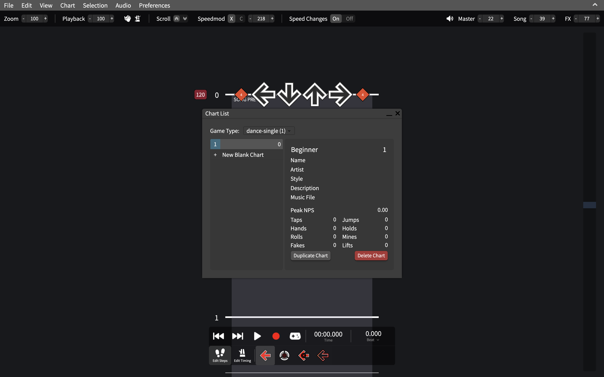
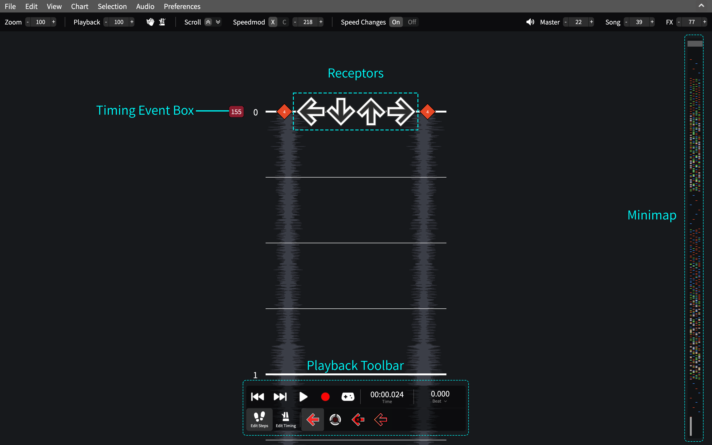
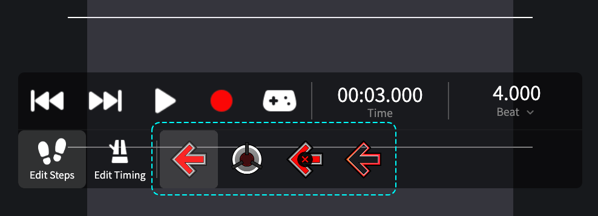
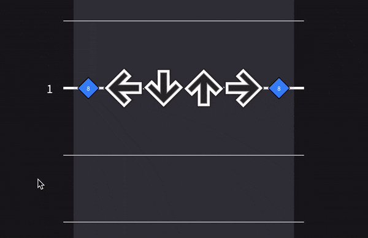

# Basic Guide

This is a basic guide on how to create your first simfile in SMEditor.

[[toc]]

## Getting Started

You can create a new simfile using the **New Song** button on the startup screen
or through *File > New song...* on the menubar.

You will then be prompted to fill out a few details about your simfile.

The most important fields to fill out are the **Title** and **Artist** of the song,
as well as an **Audio Track** (or the song file).
Filling out the rest of the fields is not required, and you can always come back and
fill them out later under *Chart > Song properties...*

You can upload a song file by clicking on the field labeled "click to upload a file".

::: tip
Most simfiles use OGG files instead of MP3 files due to syncing issues.
You can convert your song into an OGG before uploading it.
:::

Once you are done, click **Create** to start charting. If you are using the desktop app,
you will be prompted to select a location to save the new simfile.

## Creating a new chart

After creating the simfile, you will be met with this screen.

Each simfile can contain multiple charts, each with a different difficulty rating.
To create your first chart, click **Create a new chart** at the center of the screen.
This will open up the Chart List Window (accessible under *Chart > Chart list*)

::: info
Creating a chart for doubles/pump? Select a different game type from the dropdown first.
:::

Clicking on *New Blank Chart* will add a new chart to the left side of the window
and its details will appear on the right. You can change the difficulty and details
of each chart by directly editing them on the right.

Now that you have a new chart, you can close the window.

## Terminology

Here are the names of some parts of the editor:

## Syncing

The first step to creating a new chart is to get the correct tempo and offset.

::: tip
Used to ArrowVortex? You can select *Chart > Edit timing data at row* for a similar experience.
:::

You can find the tempo by using a [tap for BPM program online](https://www.all8.com/tools/bpm.htm)
or by using the [Detect Sync feature](./auto-sync).

By default, the tempo is set to 120 beats per minute. You can change this by clicking on the red timing event
box on the left of the receptors.

If the tempo changes throughout the song you selected, you can read up on how to use
multiple timing events [here](./timing-events).

---

Next, you can set the offset, measured in seconds, to start the song earlier or later.
Negative values will start the song before beat 0, while positive values will start it
after.

You can change the offset by clicking the Edit Timing button on the playback toolbar.

---

You can check if you have synced the chart correctly by enabling **Assist Tick** or the **Metronome**,
located in the submenu at the top of the screen.
**Assist Tick** will play a tick every time a note should be played, while the **Metronome** will
play a sound on every beat.

## Navigation

Here are some basic controls for navigating the chart:

| Action                | Keystroke                  |
|-----------------------|----------------------------|
| Play/Pause            | Space                      |
| Moving Up/Down        | Up / Down or scroll wheel  |
| Previous/Next note    | , / .                      |
| Previous/Next measure | ; / ' or PageUp / PageDown |
| Start/End of song     | Home / End                 |
| Change snap           | Left / Right               |

By default, scrolling or pressing up and down moves the cursor by one beat.
You can change this increment, also known as the "snap", by pressing the left and right
arrow keys. The current snap is displayed as two diamonds next to the receptors.

## Placing notes

There are several ways to start placing notes, but all of them use the note palette on the
Edit Steps tab of the playback toolbar. The Tap note is selected by default, but this can be
changed by clicking on a different note type or cycling between them using N/M.

### Number Keys

Pressing the number keys (1,2,3,4,...) will place a note at the current beat.
Pressing a number key while a note is already present will instead remove it.

To place a hold, hold the number key down and move the cursor.
To place a roll, hold shift while placing a hold.

### Mouse Placement

To use your mouse to place notes by toggling mouse note placement under
*Edit > Enable Mouse Note Placement*.
When hovering over the playfield, a ghost note will appear. Click to place a note
where the mouse is located. Clicking on an existing note will instead remove it.

To place a hold, click and drag. To place a roll, drag and then hit Shift.

### Record Mode

You can record a sequence of steps in real-time by selecting the record button in the
playback toolbar. You can then use your gameplay keys (default arrow keys) to place notes
while the music plays.

<video controls="controls" src="./basic-guide-assets/record.mov"/>

## Playtesting

Clicking the playtest button on the playback toolbar allows you to play your chart. The default
keybinds are the arrow keys and WASD, but these can be changed under *Preferences > Gameplay keybinds...*

<video controls="controls" src="./basic-guide-assets/playtest.mov"/>

You may want to set your global offset to compensate for the delay between hitting the keys
and the computer registering the input. This offset will apply to every chart you play and can
be set under *Preferences > Options...*. This offset does not affect the timing of **Assist Tick**,
so if it still sounds off, your song offset is incorrect.

The Play Statistics tab in the bottom left shows info about your performance, including a
histogram for how early or late you were hitting the notes. If you were hitting consistently
early or late, this could be an indication of a misaligned offset. You can click the buttons
below the histogram to automatically readjust the offset according to the previous play.

## Saving and Exporting

To save your work, select *File > Save*.

If you are using the desktop app, this will automatically save your work to your hard drive.

If you are using a browser, your work will be saved inside your browser's file system.
To export your work to your hard drive, select *File > Save and export current song*.

::: warning
Remember to save your work regularly, since there is no autosave.
:::
