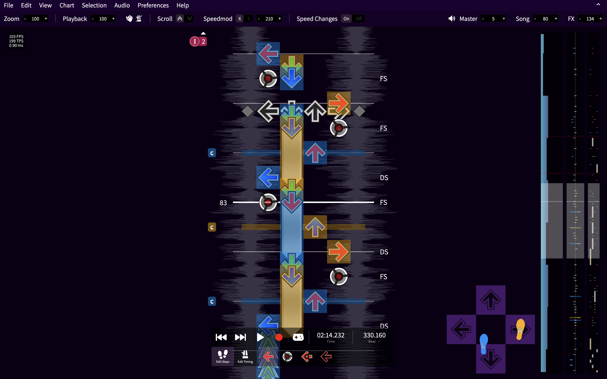
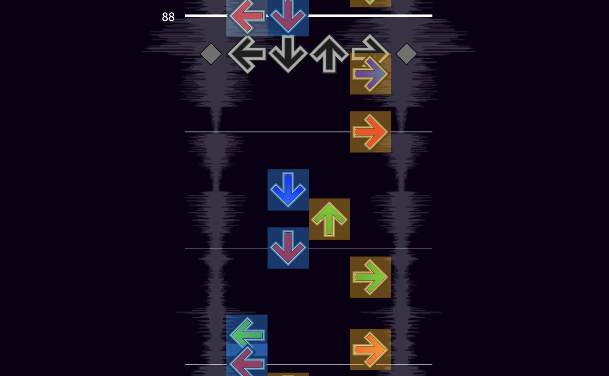
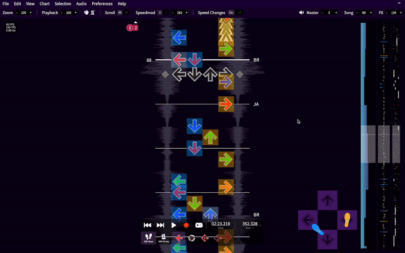
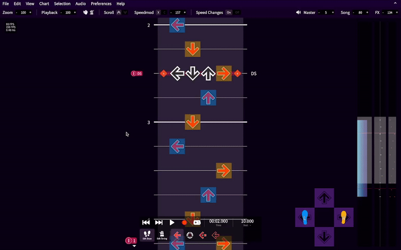
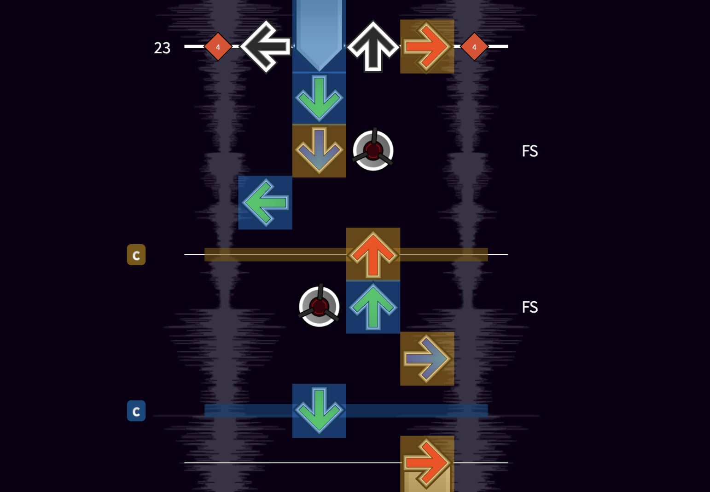
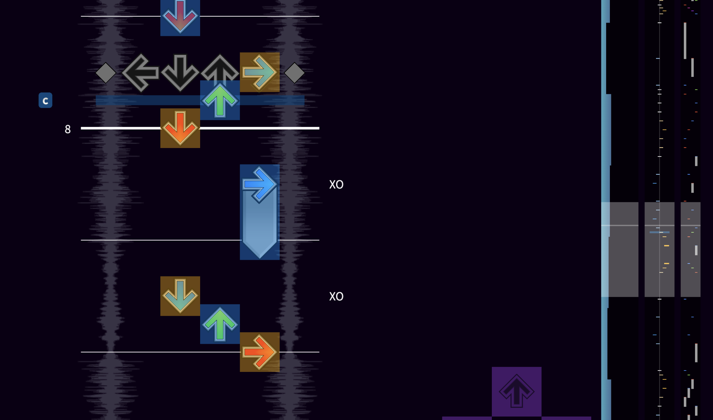
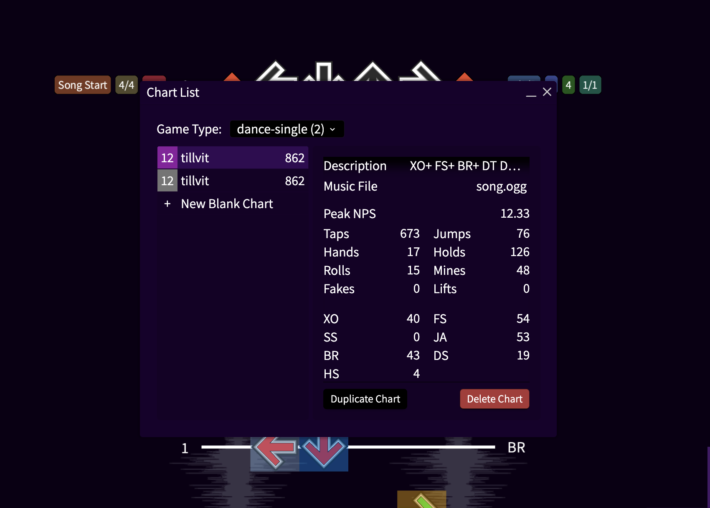
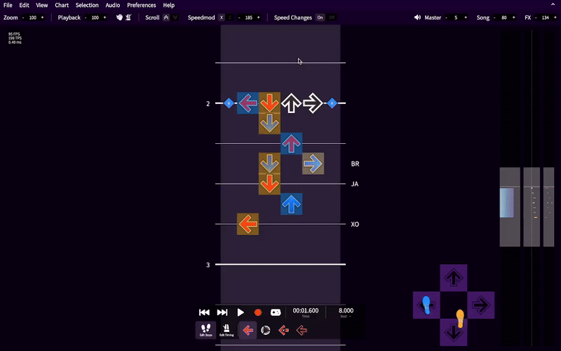

# Parity Checking

[[toc]]

## Introduction

SMEditor can predict which foot a player would use to step on each arrow. This can allow
SMEditor to automatically identify tech and warn you about flow errors.

You can enable parity checking using the default keybind `E`, through *View > Parity > Enable parity checking*,
or the preferences menu.

::: tip
Charting for 4K/spread? This feature is meant for pad-oriented charts.
:::

## Features

### Foot Highlights

When this option is enabled, each note will be highlighted with a blue or orange box.
Blue boxes represent the left foot and orange boxes represent the right foot. Lighter
colored boxes, used for brackets, are used to represent the toes of each foot.

### Tech Notation

When this option is enabled, tech notation will appear on the right of the notefield.
You can hover over them to learn more.

### Tech Errors

When this option is enabled, any flow errors will be highlighted in red and an icon will appear
on the left of the notefield. Errors will also appear in the timelines on the right of the screen.

You can hover over these errors to learn more. Clicking on the error ignores it, removing the red highlight.

If there are errors off the screen, an indicator will appear. Clicking on them will jump to the next
unignored error. To include ignored errors, shift click the indicator.

Keybinds can also be configured to jump to the previous and next unignored error.

### Candle Highlights

When this option is enabled, candles (moving a foot vertically across the center panel) will be highlighted
with the corresponding foot's color and a `C` will appear on the left of the notefield.

Keybinds can also be configured to jump to the previous and next candle.

### Facing Timeline

When this option is enabled, a timeline will appear on the right of the screen. This timeline
shows which direction the player is facing. Blue boxes on the left mean that the player is rotated
to the left and orange boxes on the right mean that the player is rotated right.
Crossovers (which require the player to be turned a large angle) will be notated with a slightly larger box.

Additionally, if candles are enabled, they will appear in this timeline.

You can turn this timeline off in the preferences.

### Dancing Bot

When this option is enabled, a stage will appear in the bottom right of the screen which plays the chart.

### Tech Counts

When parity checking is enabled, you can see the number of each tech in the Chart List Window.

## Correcting the parity checker

Sometimes, the parity checker does not predict the correct foot to use! Some known situations that can cause this are:
- Lots of decorative mines are used
- Holds are used with laterals
- Brackets with candles

If the algorithm predicts incorrectly, you can select an arrow to force the algorithm to use a certain foot. This
will make a red line appear above the arrow. Keybinds can be set to override a note.

