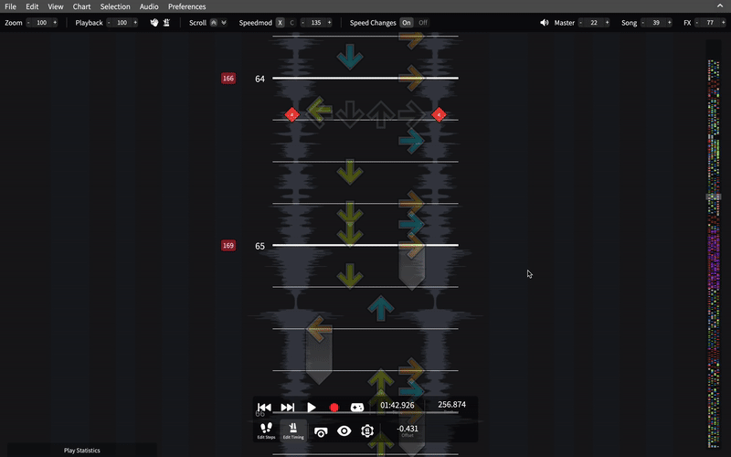
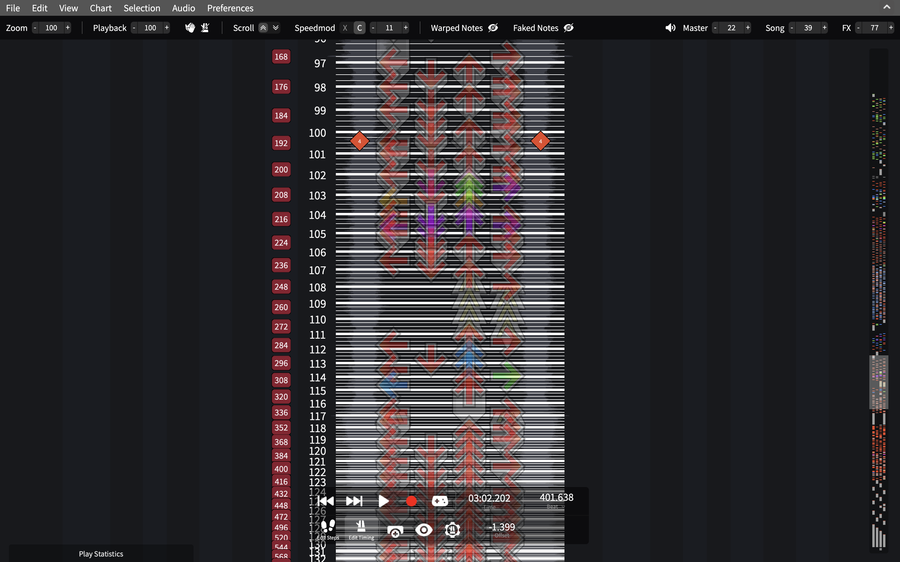
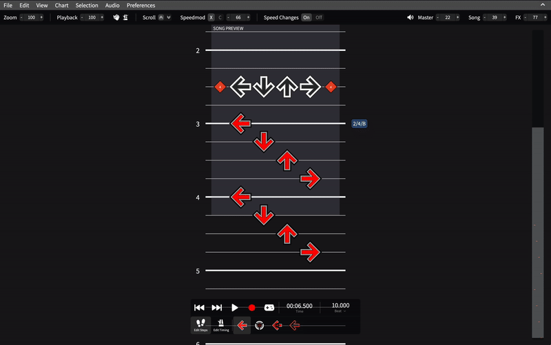
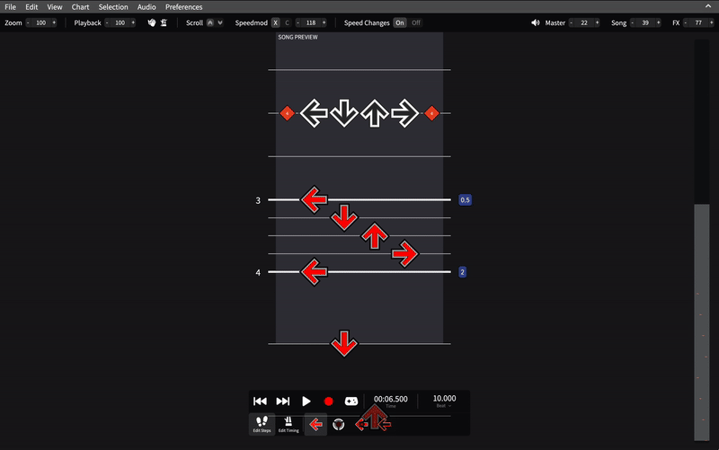
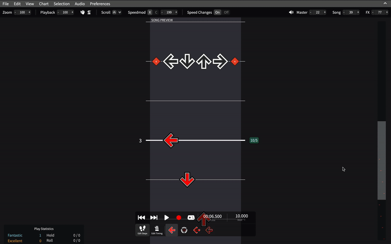

# Timing Tracks and Events

This page will guide you on how to add timing events to your chart, such as BPM changes
or scroll gimmicks.

[[toc]]

## Introduction

Timing events are events that occur at a specific point in time that trigger some sort of
change. There are many types of timing events, such as BPM events, which change the chart's
tempo.

Timing events are represented in SMEditor as colored boxes that appear on the left and right
side of the playfield. Each type of event has its own color.

## Editing timing events

::: tip
Used to ArrowVortex? You can select *Chart > Edit timing data at row* for a similar experience.
:::

To start editing timing events, click the **Edit Timing** button in the playback toolbar.
This will rearrange the timing events into different columns, also known as "tracks",
based on their type.

Being in this mode allows you to shift timing events by dragging them and select multiple events
by highlighting an area.

---

To add a timing event, click the **Add timing event** button. A ghost timing event box will appear
where your cursor is. Clicking will place the timing event and allow you to edit its details.

To edit an existing timing event, click on it and its details will open. To delete a timing event,
click on the **Delete** button or press Backspace.

## Hiding and rearranging timing tracks

You can hide or rearrange timing tracks by clicking on the **Toggle Timing Track Visibility** button
in the playback toolbar.

To move a track, drag it across the popup.

To delete a track, hover over the track and click on the trash button.

To restore a track that has been deleted, click on the track from the bottom tray or drag it back into the grid.

## Types of timing events

### Standard Events

These events can be used in versions or forks of Stepmania above 3.95 that use the SM file format.

BPMS

A BPM event contains one field: the tempo in beats per minute. This event can be used
to deal with songs with varying tempos.

---

STOPS

A STOP event will pause the chart at the beat it's on before a specified number of seconds.
Notes that occur on the STOP will be hit before the pause starts. In CMod, stops will be notated with a yellow area.

Negative values will instead skip forward instead of stopping. Notes inside the skipped
area will not be hit. This will appear as a yellow area in XMod.

---

BGCHANGES
 and 
FGCHANGES

Both of these events are used to make effects occur in the background or foreground.

You can learn more about them [here](https://outfox.wiki/en/dev/mode-support/sm-support).

---

ATTACKS

ATTACKS apply modifiers to the chart, such as Bumpy or Reverse. Unlike all the other events, the time this event occurs
is based on the second.

You can learn more about them [here](https://outfox.wiki/en/dev/mode-support/sm-support).

:::info
Modifiers are not shown in SMEditor, so editing them is not recommended.
:::

### SM5 Events

These events are specific to versions of Stepmania above 5 that use the SSC file format.

DELAYS

Similar to STOPS, a DELAY event will also pause the chart for a specified number of seconds.
The difference between STOPS and DELAYS is that notes that occur on the DELAY will be hit
*after* the pause starts.

---

WARPS

A WARP event will skip forwards a specified number of beats. This will appear as a pink area in XMod.
Notes that occur on the WARP or are skipped by the WARP will not be hit.

::: info
Since this effect is similar to a negative stop, all warps will be converted to negative stops
when exporting in the SM file format.
:::

---

FAKES

A FAKE event makes all notes in the next specified number of beats unable to be hit. This will
appear as a gray area.

---

SPEEDS

A SPEED event multiplies the scroll speed of the *whole playfield* by a constant. This constant can be increased
or decreased over a specified number of beats or seconds. The multiplier can also be negative.

SPEED events are disabled in CMod or when **Do Speed Changes** is off.

---

SCROLLS

A SCROLL event multiplies the scroll speed of the beats *after the event* by a constant. The multiplier can also be negative.

SCROLL events are disabled in CMod or when **Do Speed Changes** is off.

::: warning
Having the last SCROLL in your chart have a multiplier of 0 will make it impossible to view any beats after it!
If you want to add another SCROLL after, turn **Do Speed Changes** off.
:::

---

COMBOS

A COMBO event changes the number of combo gained when hitting or missing a note. There are two
multipliers: a hit combo multiplier and a miss combo multiplier. Both of these multipliers must
be positive integers.

---

TIMESIGNATURES

A TIMESIGNATURE event allows you to change the time signature (which affects barlines and quantizations).

Each measure will start with a red quantized note, even if the time signature is irregular.

:::warning
Note that this behavior does not exist in Stepmania, instead quantizations are based off the
global beat.
:::

---

LABELS

A LABEL event allows you to label certain parts of a song.

---

TICKCOUNTS

A TICKCOUNT event specifies how many ticks per beat in a hold there are. This
only applies to pump gamemodes.
